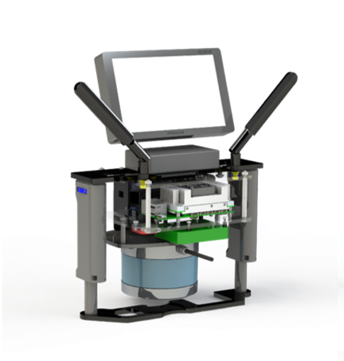
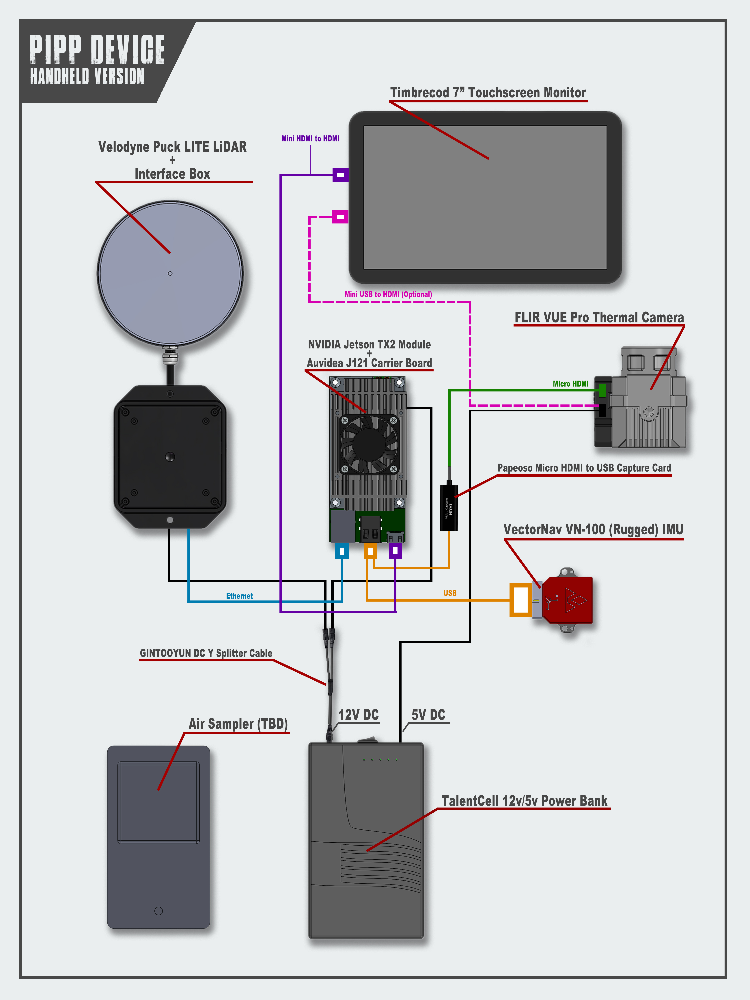

# PIPP Workspace





## 1. Prerequisites
### 1.1. Ubuntu and ROS

The code has been tested to work in **Ubuntu 18.04 + ROS Melodic** and **Ubuntu 20.04 + ROS Noetic**. ROS2 currently is not supported.

Please follow the [Instrunction](http://wiki.ros.org/ROS/Installation) to install ROS.

### 1.2 Dependencies

Please follow the [Instruction](https://github.com/Alexwei92/lidar_slam.git) to install all dependencies.

## 2. Installation

```bash
git clone https://github.com/Alexwei92/pipp_ws.git
cd pipp_ws/src
git submodule update --init --recursive
cd ..
catkin_make
source devel/setup.bash
```

## 3. Example
### Offline with downloaded rosbag files:
```bash
roslaunch lidar_slam mapping_velodyne_v5.launch
rosbag play --clock DOWNLOADED_FILE.bag
```
### Online with our IMU, LiDAR, and camera sensors:
```bash
roslaunch lidar_slam connect_imu.launch
roslaunch lidar_slam connect_camera.launch
roslaunch lidar_slam connect_lidar.launch
roslaunch lidar_slam mapping_velodyne_v5.launch
```

## Licence

The source code is released under [GPLv3](http://www.gnu.org/licenses/) license.
